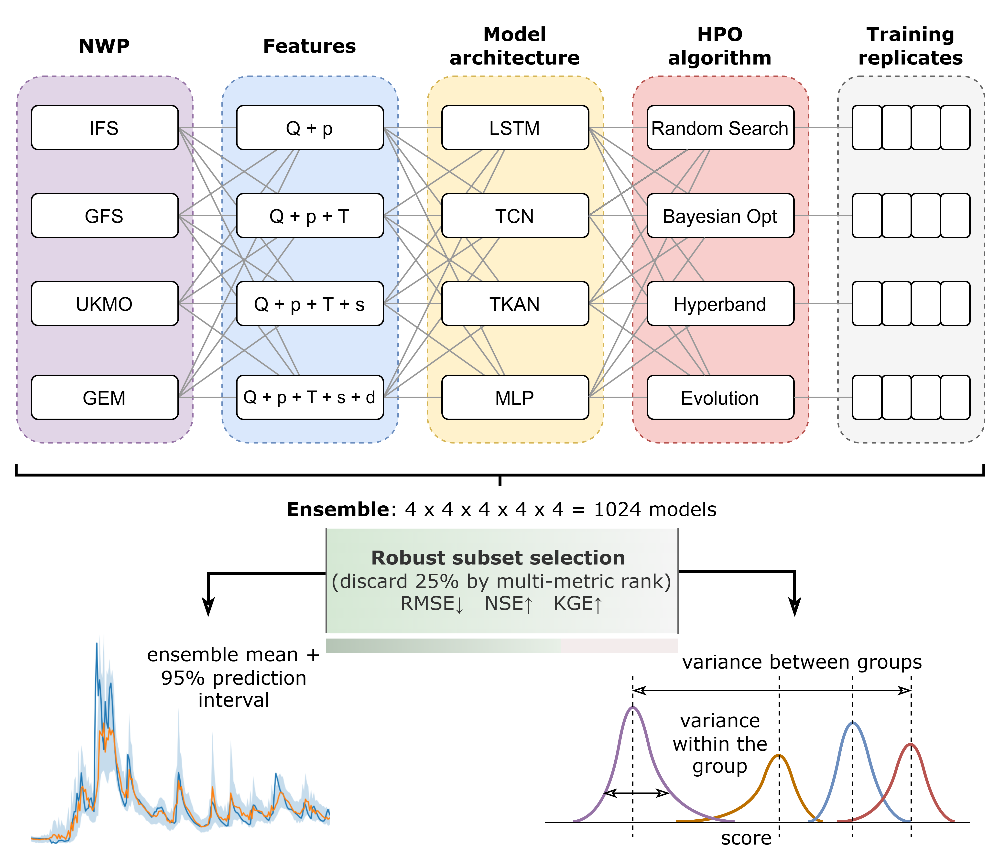

# HYDRO-ML-UQ: Machine Learning Workflow for Uncertainty Quantification in Streamflow Forecasting

Operational streamflow forecasts are essential for flood preparedness and reservoir management. However, predictive uncertainty is often poorly characterized, limiting the reliability of decisions based on these forecasts. This repository implements an **end-to-end multi-model uncertainty quantification (UQ) framework** for operational streamflow forecasting. Unlike standard approaches that treat uncertainty as a property of the predictive model alone, this framework decomposes and attributes uncertainty across the **entire forecasting workflow**: meteorological forcing choice, feature design, model architecture, hyperparameter optimization (HPO), and training variability.

The framework enables systematic analysis of how uncertainty emerges, propagates, and shifts across forecasting lead times, providing actionable guidance for improving forecast reliability and decision-making.

---

## Workflow Overview



The workflow evaluates multiple combinations of:

- **NWP forcings:** IFS, GFS, UKMO, GEM  
- **Feature sets:** Q, Q+p, Q+p+T, Q+p+T+s, Q+p+T+s+d  
- **Model architectures:** LSTM, TCN, TKAN, MLP  
- **HPO strategies:** Random Search, Bayesian Optimization, Hyperband, Evolutionary  
- **Training replicates:** multiple independent runs to capture variability

Ensembles explore all combinations, systematically quantifying uncertainty contributions from each stage.

---

## Repository Contents

- `run_experiments.py`: trains the full model grid, writes trained models, scalers, metrics, and tuning summaries  
- `data_utils.py`: data loading, cleaning, synchronization, scaling, train/validation/test splitting 
- `hp_tuning.py`, `models.py`, `metrics.py`: training, HPO, and diagnostic utilities 
- `full_pipeline_analysis.py`: scans trained runs, computes ensemble summaries, selects retained models, and generates analysis tables  
- `analysis_utils.py`: model-loading, caching, metrics, ensemble, and attribution helpers  
- `figure2.py` – `figure5.py`: regenerate paper figures from retained runs  
  

Store large data/model/output folders:

- `data/`  
- `models/`  
- `final-models/`  
- `analysis_out_v4/`  
- `figures/`  
- `pred_cache/`, `pred_cache_v4/`  

---

## Environment Setup

Recommended: Python 3.11

```bash
python -m venv .venv
.venv\Scripts\activate   # Windows
# source .venv/bin/activate  # Linux/macOS
pip install -r requirements.txt
```

## Expected Data Layout

Before running the scripts, your `data/` folder should have cleaned input CSVs:

```text
data/
  Q.csv
  clean_<nwp>_<variable>_lead_<lead>h.csv
```

Where
- **`Q.csv`** → observed discharge  
- **`clean_<nwp>_<variable>_lead_<lead>h.csv`** → preprocessed NWP forcings  
- **Default NWP sources:** ifs, ukmo, gfs, gem  
- **Default variables:** tp_daily, t2m_raw, sd_raw  
- **Lead times:** 24, 48, 72, 96, 120 hours

---

## How to Reproduce

Run scripts in the following order. Each step depends on outputs from the previous one.

**Step 1 — Train the model ensemble**
```bash
python run_experiments.py
```
Trains all pipeline combinations (NWP × features × architecture × HPO × replicates). Writes trained `.keras` models and `tuning_summary.json` files under `final-models/`.

**Step 2 — Run the full pipeline analysis**
```bash
python full_pipeline_analysis.py
```
Scans trained runs, computes per-model metrics, applies the robustness screen, computes ensemble and probabilistic metrics, and populates the prediction cache. Writes outputs to `analysis_out_v4/tables/`, `analysis_out_v4/plots/`, and `pred_cache_v4/`.

**Step 3 — Generate figures**
```bash
python figure2.py
python figure3.py
python figure4.py
python figure5.py
```
All figure scripts read from `analysis_out_v4/` and `pred_cache_v4/`. Figures 2, 3, and 5 require the prediction cache to be populated (Step 2 must be run first). Figure 4 reads only from `analysis_out_v4/tables/`. Outputs are written to `figures/`.

> **Practical note for future use:** Based on the conclusions of this study, a
> single training replicate per pipeline and Bayesian optimization as the sole
> HPO algorithm are sufficient for most applications. This reduces the full
> factorial grid (1024 pipelines) to a much smaller ensemble while preserving
> the most informative uncertainty structure, substantially lowering the
> computational cost of the framework.

---

## Third-Party Dependencies

`tcn` and `tkan` layer implementations are provided by `keras-tcn` (Remy, 2018;
based on Bai et al., 2018) and `keras-efficient-kan` (based on Genet & Inzirillo,
2024) respectively. Both are listed in `requirements.txt` and installed automatically
via `pip install -r requirements.txt`. No separate installation steps are needed.

---

## Data Availability

Observed discharge data for the Prijepolje station were obtained from the annual hydrological yearbooks of the Republic Hydrometeorological Service of Serbia (RHMSS). NWP forecast data are available from the TIGGE archive (https://apps.ecmwf.int/datasets/data/tigge/) and the NCAR GFS repository (https://doi.org/10.5065/D65D8PWK).
